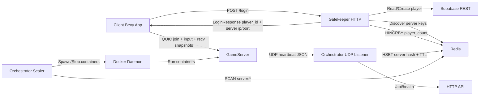
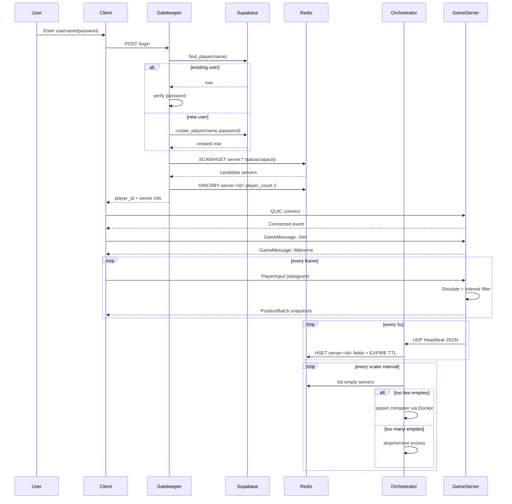

# Repository Architecture Analysis

This document analyzes each folder in the repository and explains how the components work internally and how they interact as a distributed game platform.

## 1) Top-Level Repository Overview

The workspace is a Rust monorepo with multiple crates:
- `client`: Bevy game client with login UI, networking, input, and interpolation.
- `common`: Shared types and helpers (packets, heartbeat schema, Redis client, constants).
- `game_sockets`: Transport abstraction library (QUIC, TCP, UDP backends).
- `GameServer`: Dedicated game server running simulation + networking + heartbeat emission.
- `gatekeeper`: Login/auth and server-assignment HTTP service.
- `Orchestrator`: Fleet manager, heartbeat listener, and Docker scaler.
- `quadtree`: Spacial service dictating the server configuration and dealing with authority transfers

Infrastructure around those crates:
- root `docker-compose.yml`: runs Redis + Gatekeeper + Orchestrator, and defines game-server image.
- `docs`: runtime screenshots.
- `target`: Rust build artifacts.
- `.cargo`: cargo build profile tuning.

---

## 2) Folder-by-Folder Analysis

## `.cargo`

### Purpose
Holds local Cargo build profile overrides.

### How it works
- `config.toml` sets aggressive release optimization and improves development speed for heavy dependencies:
  - `release`: `opt-level=3`, `lto=thin`, `strip=symbols`.
  - `dev`: `opt-level=1` for local crate, but `opt-level=3` for dependencies (`[profile.dev.package."*"]`), which is helpful for Bevy/physics performance during development.

---

## `client`

### Purpose
Interactive game client (Bevy app) with three phases:
1. login to gatekeeper,
2. connect to assigned game server via QUIC,
3. play and render replicated entities.

### Structure
- `main.rs`: starts `src::run()`.
- `src/mod.rs`: app bootstrap and state machine.
- `src/login.rs`: full login UI and async HTTP auth flow.
- `src/net.rs`: QUIC connection lifecycle and packet handling.
- `src/input.rs`: sends movement input to server.
- `src/interpolation.rs`: spawns/interpolates remote entities from snapshots.

### Internal behavior
1. `run()` initializes Rustls crypto provider and Bevy `DefaultPlugins`.
2. State machine (`GameState`): `Login -> Connecting -> InGame`.
3. Login flow:
   - captures username/password in UI.
   - POST `/login` to gatekeeper.
   - receives target server (`ip`, `port`, `zone`).
   - stores `GameSession` resource and transitions to `Connecting`.
4. Connecting flow:
   - creates `GamePeer` with QUIC backend.
   - connects to server.
5. In-game flow:
   - `input.rs`: reads keyboard, serializes `PlayerInput`, sends on stream 0.
   - `net.rs`: receives the individual position of every entity in its area of interest.
   - `interpolation.rs`: creates circles/name tags for unseen entity ids, then lerps transform to latest target position.

### Key design choices
- Uses shared packet types from `common` (`PlayerInput`), reducing wire-protocol drift.
- Uses optimistic interpolation with `POSITION_DELTA_THRESHOLD` to avoid micro-jitter updates.
- Keeps network peer in `Mutex<GamePeer>` for Bevy resource synchronization.

---

## `common`

### Purpose
Shared contract crate used by gatekeeper, orchestrator, server, and client.

### Contents and role
- `packets.rs`:
  - `PlayerInput` for client movement commands.
  - also defines `ConnectRequest` / `AuthAck` structs.
- `heartbeat.rs`:
  - `Heartbeat` schema sent from game server to orchestrator.
- `server_info.rs`:
  - canonical server metadata (`id`, `ip`, `port`, `zone`, `status`, `player_count`, `max_players`).
- `redis_client.rs`:
  - async wrapper over Redis `ConnectionManager` with `scan`, `hset_multiple`, `hget`, `expire`, `hincr`, etc.
- `constants.rs`:
  - transport/visibility tuning values:
    - `POSITION_DELTA_THRESHOLD`.
- `redis_keys.rs`:
  - key helpers like `server:<id>`.

### Why it matters
This crate is the integration backbone. It aligns data models across services and avoids duplicate schema definitions.

---

## `docs`

### Purpose
Documentation assets (screenshots of runtime behavior).

### How it works
Contains PNG captures of:
- orchestrator startup,
- running containers,
- login UI and success,
- gatekeeper logs,
- client welcome,
- heartbeat logs,
- dynamic server orchestration logs.

It supports manual verification and presentation, not runtime logic.

---

## `game_sockets`

### Purpose
Pluggable network transport abstraction exposing a unified API (`GamePeer`) over multiple protocol backends.

### Structure
- `src/lib.rs`: defines core types and command/event channels.
- `src/protocols/quic_protocol.rs`: primary production backend.
- `src/protocols/tcp_protocol.rs`: framed TCP backend.
- `src/protocols/udp_protocol.rs`: custom packetized UDP backend.

### How it works
1. `GamePeer` owns:
   - command sender to backend thread,
   - event receiver from backend thread,
   - stream id allocator.
2. Public API:
   - `listen`, `connect`, `create_stream`, `send`, `poll`, `shutdown`.
3. Backend thread model:
   - each backend implements `GameSocketBackend::run`.
   - backend executes in dedicated thread and can spawn Tokio tasks.

### QUIC backend specifics
- Uses Quinn + Rustls with self-signed cert setup.
- Enables low-latency transport tuning:
  - BBR congestion,
  - low initial RTT,
  - keep-alive,
  - datagram buffer tuning.
- Supports:
  - unreliable datagrams (for high-frequency updates),
  - reliable bidirectional streams (framed messages with length prefix).

### Stream encoding model
`GameStream` packs reliability/order metadata in low bits of stream id (`RELIABILITY_MASK`, `ORDERING_MASK`), giving a compact lane descriptor.

---

## `GameServer`

### Purpose
Dedicated authoritative simulation server for gameplay sessions.

### Structure
- `src/main.rs`: starts Bevy app with `ServerPlugin` + `SimulationPlugin`.
- `src/server.rs`: network bind, packet receive loop, join/welcome handling, heartbeat sending.
- `src/simulation.rs`: physics world, player spawn/despawn/input application, snapshot broadcast.
- `src/char_controller.rs`: movement and grounded-state systems.
- `src/interest.rs`: visibility culling based on radius.
- `src/net.rs`: sim command channel and connection registry helpers.
- `src/messages.rs`: `GameMessage::{Join,Welcome}` contract.
- `src/heartbeat.rs`: local heartbeat struct (currently duplicate of shared schema).

### Runtime behavior
1. On startup:
   - reads env config (`DS_PORT`, `DS_ID`, `DS_PUBLIC_IP`, `DS_ZONE`, `MAX_PLAYERS`, `ORCH_HOST`).
   - binds QUIC listener.
2. On client connect:
   - stores connection in `ConnectedPlayers`.
3. On `Join` message:
   - inserts player into registry.
   - pushes `SimCommand::PlayerJoined` into simulation.
   - responds `Welcome { player_id }`.
4. Input handling:
   - receives serialized `PlayerInput` and forwards into simulation via channel.
5. Simulation tick:
   - drains join/leave/input commands.
   - updates physics and player movement.
   - sends per-entity `PositionPayload` on stream 0.
6. Heartbeat:
   - every 5 seconds sends JSON UDP heartbeat to orchestrator (`id`, `ip`, `port`, occupancy, capacity).

### Notable architecture detail
The game server is authoritative for positions and occupancy reality, while gatekeeper uses Redis approximations for routing in-between heartbeat intervals.

---

## `gatekeeper`

### Purpose
Authentication/entry gateway for clients.

### Structure
- `src/main.rs`: starts Axum HTTP on `0.0.0.0:3000`.
- `src/routes/join.rs`: `POST /login` request flow.
- `src/routes/health.rs`: liveness endpoint.
- `src/db.rs`: Supabase REST client wrapper.
- `src/redis_ops.rs`: server discovery and player count increment logic.

### Login workflow
1. Validate non-empty username/password.
2. Query Supabase `PlayerInformation` table:
   - if user exists: password check.
   - else: create user.
3. Query Redis for best server candidate:
   - considers `status in {empty, available}`.
   - ranks `available` before `empty`.
   - among same class, favors highest `player_count` to fill active instances first.
4. Atomically `HINCRBY player_count +1` on selected server.
5. Return JSON:
   - `player_id` (db id as string),
   - selected `ServerInfo` (ip/port/zone/status/capacity).

### Key integration role
Acts as traffic director from identity layer to runtime world instance.

---

## `Orchestrator`

### Purpose
Fleet-control plane for game servers.

### Structure
- `src/main.rs`: service startup and task orchestration.
- `src/config.rs`: environment parsing defaults.
- `src/services/heartbeat_listener.rs`: UDP heartbeat ingestion + Redis persistence.
- `src/docker_ops.rs`: Docker API operations for container lifecycle.
- `src/api/health.rs`: health endpoint under `/api/health`.
- `mock_server.sh`: test heartbeat generator.

### Runtime behavior
1. On startup:
   - loads config (`PORT`, `ORCH_PORT`, `REDIS_URL`, `DS_BASE_PORT`, `HOT_SERVERS_MIN`, etc).
   - connects to Redis.
   - starts heartbeat listener task (UDP).
   - connects to Docker daemon and starts scaler task.
2. Heartbeat listener:
   - receives JSON UDP payloads from game servers.
   - computes status:
     - `empty` if players = 0,
     - `full` if players >= max,
     - else `available`.
   - writes to `server:<id>` hash in Redis.
   - sets TTL (`HEARTBEAT_TTL_SECONDS`) so stale servers auto-expire.
3. Receives updates from the quadtree service
   - Spawn new servers matching the configuration
   - Wait for all servers to be spawned, then destroys the old servers.
4. Docker spawning:
   - injects env vars (`DS_ID`, `DS_PORT`, `DS_PUBLIC_IP`, `ORCH_HOST`, etc).
   - maps UDP game port to host.
   - pre-registers Redis entry with `status=starting`; later overwritten by heartbeat state.

### Why this is important
Orchestrator closes the loop between observed capacity and desired warm capacity.

---
### `QUADTREE`

---

## `quadtree`

### Purpose
The `quadtree` crate serves as the spatial partitioning coordinator and dynamic world sharding engine. It is responsible for tracking entity positions globally, dynamically splitting or merging spatial regions (shards) based on player density, and informing the `Orchestrator` and `broker` of world boundary updates to facilitate horizontal scaling of game server instances.

### Structure
- `config.rs`: Manages environment configuration mapping parameters such as world dimensions, depth limitations, and capacity rules.
- `quic_client.rs`: A wrapper layer over `game_sockets` providing dedicated asynchronous QUIC client connection logic optimized for communication with the central orchestrator and broker.
- `main.rs`: Orchestrates the main execution tick loop, handles network events, runs spatial subdivision geometry logic, and coordinates player placement and area-of-interest management.

### Internal Behavior
1. **Startup & Network Initialization**:
   - Spawns and maps configuration values derived from environment variables via `Config::from_env()`.
   - Establishes two independent, parallel QUIC links using `QuicClient`: one dedicated to the `Orchestrator` for fleet topology reporting, and one to the `broker` for real-time messaging.
   - Registers its connection with the broker, announcing its system type (`SendingSystem::Quadtree`), and subscribes to structural topics: `Topic::ShardCreated` and `Topic::PlayerStartingPosition`.
2. **The Tick Loop**:
   - Executes periodically according to the interval configured via `entity_add_interval_ms`.
   - On each tick, it processes incoming QUIC messages from the broker, resolves player placement, maps field-of-interest sets, and determines if a tree structural mutation is necessary.
3. **Dynamic Rebuild & Subdivisions**:
   - When entity density within a local spatial sector violates `max_capacity`, the quadtree triggers a geometry calculation. It splits the node into four sub-quadrants (`NorthEast`, `NorthWest`, `SouthEast`, `SouthWest`) provided the tree hasn't breached its `max_depth` restriction.
   - Structural updates execute safely by flushing positions and executing an atomic tree rewrite. Leaf boundaries collected during the query update the system's runtime collection (`SharedShardSet` and `SharedShardMap`).
4. **Player Spawning & Lifecycle Handshakes**:
   - When a `PlayerStartingPosition` payload is pulled from the broker queue, the system maps the coordinates to its active spatial cells using `find_shard_for_position`.
   - If a valid, initialized Shard UUID exists for that boundary, the quadtree executes a cluster-wide lifecycle setup via the broker:
     - Subscribes the assigned target `GameServer` (shard) to the player's inputs, disconnect events, and position channels.
     - Subscribes the quadtree itself to the entity's movement updates.
     - Publishes a `PlayerStartingPositionInShard` notification to instruct the game server to spawn the actor.
5. **Area of Interest (AoI) Culling**:
   - Leverages `area_of_interest_radius` and a configured `nearby_margin` to dynamically evaluate entity proximity.
   - Identifies which entities are close enough to cross shard borders, ensuring that position states are "ghosted" or mirrored across neighboring shard boundaries to guarantee smooth visual continuity for clients moving near edge lines.

### Key Design Choices
- **Dual QUIC Separation**: Separating broker messaging from orchestrator fleet reporting allows telemetry collection and low-latency state publishing to happen on separate streams without resource contention.
- **Safe Rebuild Synchronization**: The `rebuild` sequence utilizes structured memory take swaps (`mem::take`) and explicitly protects data mappings from premature states during insertion cycles. It preserves existing active Shard UUID connections during rewrites so the Orchestrator doesn't clean up running containers before replacements initialize.
- **Deferred Deletions**: Tracked via `PendingShardToDestroy` structures, old shards are gracefully retained until newly substituted spaces register themselves over the network, eliminating coordinate gaps or orphan player drops during live splits.

---

## `target`

### Purpose
Rust compiler artifacts and incremental cache.

### How it works
Contains build output (`debug`, deps, incremental state). It is generated data and not part of application logic.

---

## Hidden/Meta Folders

## `.git`
Repository history and SCM metadata.

## Root config files
- `Cargo.toml`: workspace members/dependencies and release profile defaults.
- `docker-compose.yml`: multi-service deployment.
- `clippy.toml`: lint policy.
- `rustfmt.toml`: formatting policy.
- `.env`: runtime environment values for compose and services.

---

## 3) Component Interaction Model

## High-Level Interaction Graph

## Detailed Runtime Sequence (Login to Gameplay)

---

## 4) Data Contracts and State Ownership

### Ownership boundaries
- Identity truth: Supabase (`PlayerInformation`).
- Fleet/server availability truth: Redis hashes `server:<id>` driven by orchestrator heartbeats.
- Live simulation truth: GameServer in-memory Bevy world.

### Temporary consistency mechanism
Gatekeeper increments `player_count` in Redis immediately after assignment. This bridges the delay until next heartbeat refresh from the game server.

---

## 5) Operational Notes

- Root compose runs core backend services and leaves client as local process.
- Orchestrator requires Docker socket mount to manage game-server containers.
- Heartbeat TTL allows passive cleanup of dead servers without explicit deregistration.
- QUIC transport handles both reliable messages and low-latency datagrams for gameplay.

---

## 6) Folder-to-Responsibility Summary

- `.cargo`: build profile tuning.
- `client`: UI/login + connection + gameplay rendering/input.
- `common`: cross-service protocol and Redis abstractions.
- `docs`: visual evidence of system behavior.
- `game_sockets`: protocol-agnostic networking layer.
- `GameServer`: authoritative simulation + session runtime + heartbeats.
- `gatekeeper`: auth and server assignment.
- `Orchestrator`: heartbeat ingestion and dynamic scaling.
- `target`: generated build artifacts.
