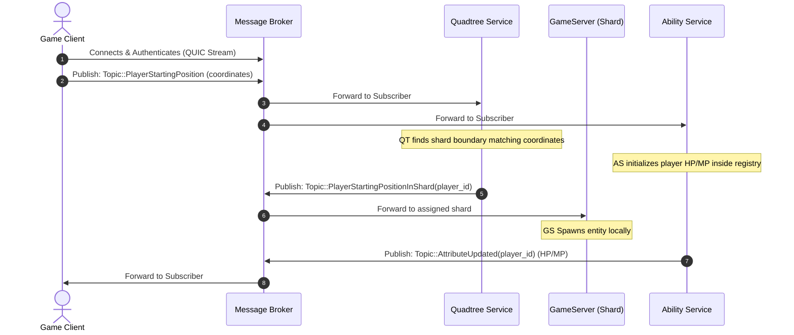
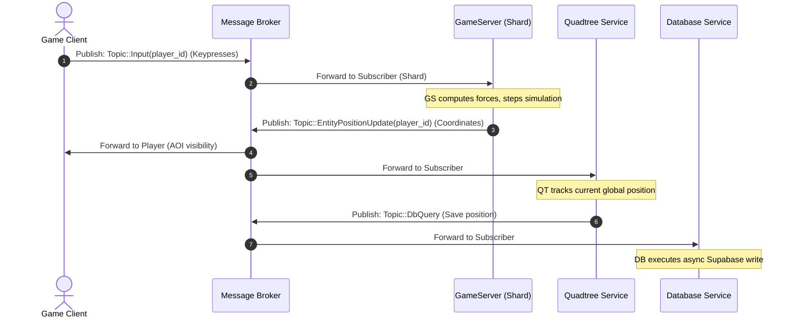
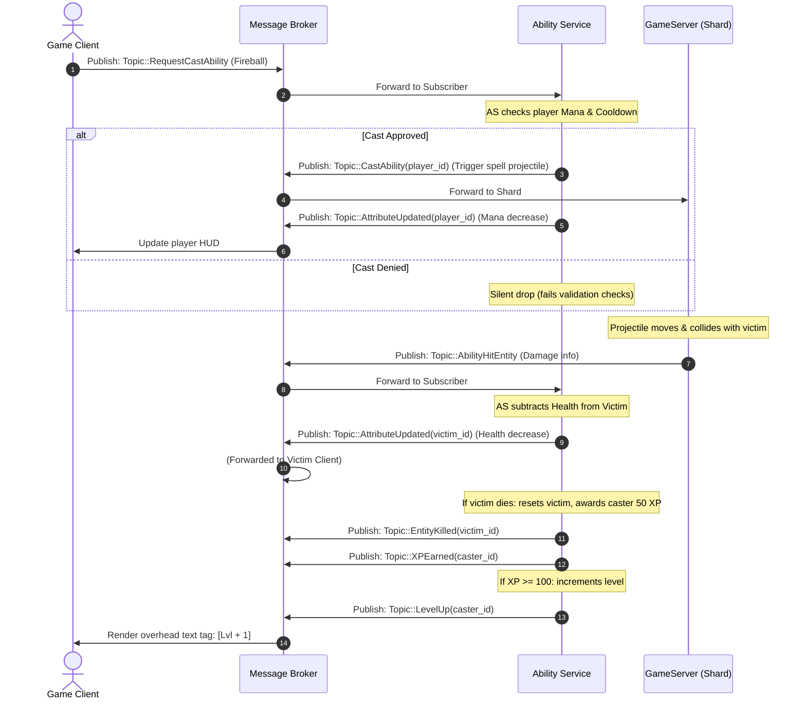
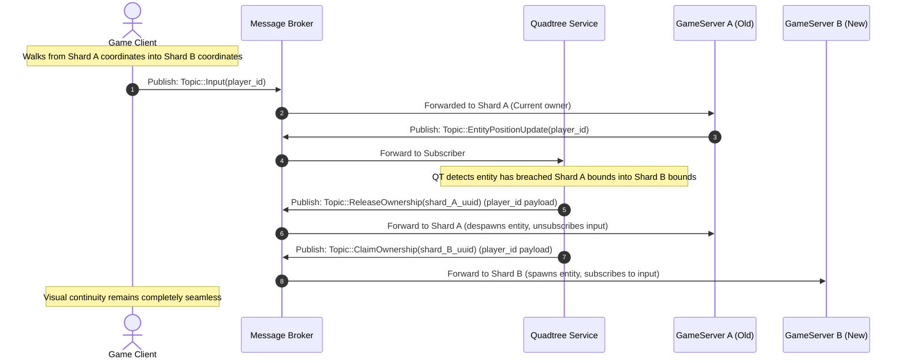

# Repository Architecture Analysis

This document analyzes each folder in the repository and explains how the components work internally and how they interact as a distributed game platform.

---

## 1) Top-Level Repository Overview

The workspace is a Rust monorepo with multiple crates:
- `client`: Bevy game client with login UI, networking, input, interpolation, and level/XP rendering.
- `common`: Shared types, constants, map grid definitions, database schema clients, and the topic definitions.
- `game_sockets`: Transport abstraction library (QUIC, TCP, UDP backends).
- `GameServer`: Dedicated game server running physics simulation (Bevy + Avian2D) and heartbeat emission.
- `gatekeeper`: Login/auth and server-assignment HTTP service communicating with Supabase and Redis.
- `Orchestrator`: Fleet manager, heartbeat listener, and Docker container lifecycle controller.
- `quadtree`: Spatial partitioning service determining the server topology and handling authority transfers.
- `broker`: High-performance message broker routing pub/sub traffic between nodes.
- `AbilityService`: Asynchronous gameplay logic engine managing entities, stats, leveling, casting, and attribute modifications.
- `ai_service`: Headless Bevy application running behavior trees to simulate monsters and NPCs.
- `database_service`: Asynchronous bridge syncing player profiles and coordinates with the Supabase database.
- `pathing_service`: Dedicated node resolving topological paths via A* and Simple Stupid Funnel smoothing.

Infrastructure around those crates:
- root `docker-compose.yml`: runs Redis + Gatekeeper + Orchestrator + Broker + auxiliary services in a unified network.
- `docs`: screenshots depicting the platform's visual and architecture state.
- `target`: Rust compilation cache and build outputs.
- `.cargo`: compiler options and build profiles.

---

## 2) Folder-by-Folder Analysis

## `.cargo`

### Purpose
Holds local Cargo build profile overrides.

### How it works
- `config.toml` sets aggressive release optimization and improves development speed for heavy dependencies:
  - `release`: `opt-level=3`, `lto=thin`, `strip=symbols`.
  - `dev`: `opt-level=1` for local crates, but `opt-level=3` for dependencies (`[profile.dev.package."*"]`), which is critical for Bevy and physics performance during iterative local runs.

---

## `AbilityService`

### Purpose
A decoupled microservice that serves as the game's stats, level, and combat manager. It unburdens the main simulation servers (GameServer shards) from processing cooldowns, attribute changes, mana regeneration, experience accrual, level progression, and entity death states.

### Structure
- `main.rs`: System entry point. Subscribes to combat and player topics, ticks the mana regeneration system, and runs the broker polling thread.
- `ability.rs`: Outlines casting costs, cooldown intervals, and spell modifiers (e.g., Fireball, Heal).
- `attribute.rs`: Represents core mutable stats such as HealthPoints and ManaPoints.
- `config.rs`: Configures tick rates, port mappings, and broker connection data.
- `entity.rs`: Tracks state, level, current/max stats, experience points, and last cast timestamps for individual entities.

### Internal behavior
1. **Bootstrap**: Establishes a QUIC connection with the Broker, registering as `SendingSystem::AbilityService`. Subscribes to `Topic::PlayerStartingPosition`, `Topic::RequestCastAbility`, and `Topic::AbilityHitEntity`.
2. **Entity Initialization**: Upon pulling `PlayerStartingPosition`, it generates a local `Entity` registry state seeded with baseline HP (50) and MP (100). It broadcasts initial stats via `Topic::AttributeUpdated`.
3. **Casting Validation**: When a player publishes `RequestCastAbility`, the service verifies the actor's cooldowns and mana. If valid:
   - Docks the appropriate mana amount.
   - Publishes `Topic::CastAbility(player_id)` to let the physics server spawn the projectile.
   - Publishes `Topic::AttributeUpdated` to update the player's HUD.
4. **Hit Resolution**: Receiving `AbilityHitEntity` prompts the service to apply the spell's attribute modifiers. It applies a caster-level multiplier (`base_multiplier + caster_level * 0.5`) to scale damage/heals.
5. **XP and Level Ups**: If an entity's health hits zero, it broadcasts `Topic::EntityKilled`, respawns the victim with default attributes, and awards 50 XP to the killer. If the killer reaches 100 XP, they increment their level, resetting progress, and publish `Topic::LevelUp`.
6. **Mana Regeneration**: A tick accumulator runs every second, restoring 5 Mana Points to all registered entities whose mana is below their maximum value.

### Key design choices
- decoupling combat logic means a spell cast with complex math does not stall the game server's movement or collision engine.
- keeping attributes in this central service permits multiple shards to safely pass players back and forth without losing player level, XP, or health state.

---

## `ai_service`

### Purpose
A headless Bevy service running Observer-based behavior trees to simulate non-player characters (like Goblins) in the game world, pushing inputs to the Broker so they are simulated identically to physical clients.

### Structure
- `main.rs`: Bootstraps Bevy with `MinimalPlugins` and behavior observer registrations.
- `components.rs`: Maps AI attributes, Perception sensors, path coordinates, and current task intents.
- `spawn_manager.rs`: Evaluates active quadtree shards to dynamically distribute NPC populations.
- `bridge.rs`: The async-to-sync bridge transforming Bevy ECS components into network actions over QUIC.
- `client.rs`: Manages individual client mock handles representing each active entity.
- `behaviour/`: Structuring the AI's cognitive loop using the `bevy_behave` behavior tree framework.
- `behaviour/trees.rs`: Defines the hierarchical behavior sequences (e.g., standard Goblin tree).
- `behaviour/actions/`: Custom action nodes:
  - `patrol.rs`: Walk random waypoints.
  - `chase.rs`: Locate and run toward nearby players.
  - `heal.rs`: Evaluate own health and cast heals on self.
  - `fireball.rs`: Sense players inside combat ranges and request spell casts.

### Internal behavior
1. **Dynamic Spawning**: Reads boundaries from the Quadtree. It evaluates shards by size and player count, spawning AI entities in active boundaries up to the limit defined by `max_ai`.
2. **Behavior Tree Ticking**: Each entity executes its behavior tree loop:
   - If low on health, attempts to trigger `CastHeal`.
   - If a player is within aggro range, triggers `CastFireball`.
   - If a player is nearby but out of spell range, switches to `Chase`.
   - Otherwise, defaults to walking a patrol route (`Patrol`).
3. **Bridge Sync**: Bevy systems convert the AI's target path points into direction vectors, translating them into `PlayerInput` inputs that are serialized and sent over Quinn to the Broker on the AI's respective mock stream.

### Key design choices
- **Mock Client Model**: Because the AI connects to the Broker using standard client streams, the GameServer does not need custom AI paths or custom monster update protocols; it simply simulates the monsters as regular players.

---

## `broker`

### Purpose
The centralized pub/sub messaging exchange. It decouples all services by routing structural updates, combat triggers, movement inputs, and database transactions through a unified message broker.

### Structure
- `src/main.rs`: Initializes configuration and runs the core loop.
- `src/net.rs`: Directs the `BrokerState` subscription registries and connection maps.

### Runtime behavior
1. **Bootstrap**: Binds to UDP port `7776`, establishing a Quinn socket.
2. **Connection Tracking**: Registers all clients, shards, and services in a `connection_map`, tying their assigned UUIDs to active QUIC connection handles.
3. **Topic Matching**: Maintains a dynamic `HashMap<Topic, HashSet<Uuid>>` tracking active subscriptions. When a publisher issues `BrokerMessage::Publish { topic, payload }`, the broker duplicates and forwards this byte stream to all registered recipients.
4. **Subscription Cleanup**: When a QUIC stream encounters a disconnect, the broker automatically sweeps and deletes all matching subscriptions, emitting a `Topic::Disconnect(client_id)` to let other systems clean up state.

### Why this is important
No service needs to know where other services reside on the network. The database, pathing, and ability engines only need to know how to locate the Broker, enabling horizontal scaling of both game servers and auxiliary logic systems.

---

## `client`

### Purpose
The interactive game client designed with Bevy, rendering entities, taking user keyboard updates, managing interpolation, and displaying the player's stats (Level, XP, HP, MP).

### Structure
- `main.rs`: Invokes app startup.
- `src/mod.rs`: Coordinates system stages and GameState transitions (`Login -> Connecting -> InGame`).
- `src/login.rs`: The visual login and registration dashboard utilizing axum/HTTP helpers.
- `src/net.rs`: Manages network state events and parses inbound broker frames.
- `src/input.rs`: Maps WASD to direction vectors, sending input packets.
- `src/interpolation.rs`: Replicates remote entities and interpolates their rendering positions over time.

### Internal behavior
1. **Handshake**: Prompts user for credentials. Issues an HTTP request to the `Gatekeeper` (`POST /login`). If accepted, transitions to `Connecting` and sets up a QUIC socket.
2. **Ingress Reading**: Listens on the Broker stream. Processes coordinates to spawn entities.
3. **Interpolation**: Receives snapshots at high frequencies. It saves coordinates in buffers and uses linear interpolation (`lerp`) to slide entity models smoothly, mitigating network jitter.
4. **Overhead rendering**: Resolves `Topic::LevelUp` and `Topic::AttributeUpdated` broadcasts. Overhead name tags are formatted to dynamically display levels (`[Lvl 3] PlayerName`).

### Key design choices
- Decouples movement inputs from visual frames, sending inputs in a fixed network tick loop.
- Draws visual debug boundaries representing Area of Interest margins and Quadtree borders.

---

## `common`

### Purpose
A shared cargo library providing standard models, serializations, protocols, and database wrappers to prevent protocol drift across the project.

### Contents and role
- `topics.rs`: Defines the system's payload structures and topic keys.
- `map_data.rs`: Outlines the discrete game bitmap dimension guidelines.
- `redis_client.rs`: Async deadpool-redis helper.
- `supabase.rs`: Core Supabase HTTP client handling user authentication and updating positional tables.
- `ability_type.rs` / `attribute_type.rs`: Shared enums mapping combat types.

### Why it matters
This crate ensures that when a packet schema changes, all components (client, server, abilities) rebuild with exact alignment, eliminating runtime decoding crashes.

---

## `database_service`

### Purpose
An asynchronous worker service executing persistent database writes to Supabase, keeping heavy database network operations completely out of the active simulation thread loops.

### Structure
- `main.rs`: Bootstraps the Supabase client and routes database queries.
- `config.rs`: Reads database keys and URL variables.

### Internal behavior
1. **Connection**: Connects to the Broker as `SendingSystem::DatabaseService`. Subscribes to `Topic::DbQuery`, `Topic::DbRegisterUsername`, and `Topic::DbNameRequest`.
2. **Correlation**: When players log in, Gatekeeper publishes their ID and username. The Database Service caches this in an internal `player_map`.
3. **Name Requests**: When a server or player requests a name tag via `Topic::DbNameRequest`, it pulls the corresponding username from memory and replies with `Topic::DbNameResponse`.
4. **Async Updates**: When a player's coordinates change, it receives a `DbQuery` payload. Instead of writing synchronously, it uses `tokio::spawn` to write to Supabase asynchronously, preventing any database write bottlenecks.

---

## `docs`

### Purpose
Visual manual assets tracking UI, logs, and server deployment state.

---

## `game_sockets`

### Purpose
A pluggable networking backend abstraction allowing the codebase to switch between QUIC, framed TCP, or raw UDP protocols through a unified `GamePeer` wrapper.

### Structure
- `lib.rs`: Outlines network event channels (`GameNetworkEvent`).
- `protocols/quic_protocol.rs`: Custom Quinn transport layer configuration (Rustls self-signed setup, datagram margins).
- `protocols/tcp_protocol.rs`: TCP handler mapping framed byte buffers.
- `protocols/udp_protocol.rs`: Low-latency, custom packetized UDP implementation.

### How it works
- The wrapper allocates a `GamePeer`. Calling `listen` or `connect` initializes the configured protocol thread.
- Messages sent have Low/High bits identifying reliability rules (`RELIABILITY_MASK` / `ORDERING_MASK`), allowing unreliable and reliable streams to coexist over a single connection context.

---

## `GameServer`

### Purpose
Authoritative physics simulation engine responsible for executing ticks, resolving player collisions, and publishing raw position states.

### Structure
- `main.rs`: Bootstraps headless Bevy running simulation systems.
- `server.rs`: Network event listener bridging broker streams with Bevy.
- `simulation.rs`: Manages Bevy entities (Local vs Ghost), boundary triggers, and updates.
- `char_controller.rs`: Enforces movement physics, acceleration, and dampening.
- `heartbeat.rs` / `net.rs`: Controls Orchestrator tracking integrations.

### Runtime behavior
1. **Initialization**: Configures world coordinate scopes on startup based on shard coordinates (`DS_SHARD_CENTER_X`, `DS_ZONE`).
2. **Input Ingestion**: Reads player input events from the broker bridge channel and inserts them as `MovementInput` components on player entities.
3. **Simulation Ticking**: Steps Bevy systems using `MinimalPlugins` and `avian2d` physics, evaluating position changes and applying obstacle boundaries.
4. **Telemetry Outflow**: Loops active local entities and publishes `EntityPositionUpdate` to the Broker at regular physics intervals.
5. **Heartbeat Emission**: Emits a UDP telemetry packet every 5 seconds to the Orchestrator on port `7000`.

---

## `gatekeeper`

### Purpose
An HTTP authentication gateway acting as the initial entry checkpoint for client users.

### Structure
- `main.rs`: Runs Axum TCP listener on `0.0.0.0:3000`.
- `routes/join.rs`: Evaluates login credentials.
- `routes/health.rs`: Liveness test.

### Login workflow
1. Checks HTTP POST payload credentials against Supabase.
2. Queries Redis to locate the best available game shard (favoring active zones with higher occupancy but below limits).
3. Atomically increases player occupancy indices (`HINCRBY player_count`).
4. Generates an access token and replies with Broker IP address details.

---

## `Orchestrator`

### Purpose
Fleet orchestrator that handles dynamic Docker scaling and node health tracking.

### Structure
- `main.rs`: Starts Axum health routes and boots background workers.
- `config.rs`: Parses configuration profiles.
- `services/heartbeat_listener.rs`: Ingests UDP ticks from active shards.
- `services/shard_handler.rs`: Translates Quadtree layout adjustments into container actions.
- `docker_ops.rs`: Interface wrapper mapping Bollard Docker daemon calls.
- `quic_server.rs`: QUIC socket receiving spatial shard updates from the Quadtree.

### Runtime behavior
1. **Telemetry Checking**: Ingests JSON UDP packets from game servers, writing records to Redis with an expiration TTL. If a server goes silent, its record expires.
2. **Fleet Scaling**: Receives updated shard layouts from the Quadtree via QUIC. Compares desired boundaries against active containers.
3. **Container Manipulation**: Spawns new `game-server` instances on host ports (`7777`+) using Docker if a quadrant divides. When quadrants merge, it stops the redundant containers.

---

## `pathing_service`

### Purpose
An isolated pathfinding service that calculates obstacle-free paths across the game world using grid graphs and funnel path smoothing.

### Structure
- `main.rs`: Builds the node graph from static bitmaps and polls path requests.
- `pathfinding.rs`: Implements Bresenham's LOS, A*, and the SSF string-pulling smoothing algorithm.
- `quic_client.rs`: Custom wrapper for Quinn socket connections.

### Internal behavior
1. **Grid Generation**: Loads a BitMap matching the static map layout. Viable nodes are linked into an adjacency graph.
2. **Line of Sight Fast Path**: Runs Bresenham's algorithm first. If a direct line of sight exists from Start to End, it bypasses A* completely, immediately returning the path.
3. **Search fallback**: If blocked, runs A* with Manhattan heuristics, using a tie-breaker factor (`1.001`) to prevent zig-zag behaviors.
4. **String-Pulling smoothing**: Converts graph grid nodes into left/right portal lines, applying a padding margin. Evaluates funnel constraints using 2D cross-products to snap path vectors tight around wall corners.
5. **Egress**: Publishes waypoints back to the entity via `Topic::PathResponse`.

---

## `quadtree`

### Purpose
The spatial partitions manager and cluster router. It tracks positions, splits/merges world regions based on density, and establishes Broker subscription boundaries.

### Structure
- `main.rs`: Main execution loops managing player entries, culling, and rebuilding coordinates.
- `quic_client.rs`: Dedicated async QUIC links to Broker and Orchestrator.
- `config.rs`: Manages dimensions, thresholds, and frequency settings.

### Internal behavior
1. **Dynamic Rebuilding**: Receives `EntityPositionUpdate` from the Broker. If a shard holds more than `QUADTREE_MAX_CAPACITY` entities, it splits into four sub-shards (up to `QUADTREE_MAX_DEPTH`). Shards with zero occupants merge.
2. **Telemetry Egress**: Broadcasts node layouts to the Orchestrator via QUIC to spin up game servers. Broadcasts `QuadtreeBoundariesUpdate` to clients to redraw debug lines.
3. **Ownership Handoff**: Monitors when entities cross shard lines, publishing `ReleaseOwnership` to the old server and `ClaimOwnership` to the new one.
4. **Deferred Cleanup**: Keeps old boundaries active in a `PendingShardToDestroy` registry until new servers report `ShardCreated`, ensuring seamless boundary handoffs.

---

## `target`

### Purpose
Rust compiler cache. Contains build outputs and dependency build artifacts. Not included in SCM tracking.

---

## 3) Distributed Message Workflow (Broker-Centric Data Flow)

In this architecture, the **Message Broker** acts as the central hub. Services and clients communicate asynchronously by publishing messages to specific topics and subscribing to domains they are authoritative for.

### System Architecture Topology

The following diagram highlights the central routing role of the Message Broker. Every line represents QUIC packet channels, with arrow directions showing publications and subscriptions:

```mermaid
graph TD
    %% Nodes
    Broker((Message Broker <br/> :7776))
    Client[Client <br/> player_id]
    GameServer[GameServer Shard <br/> shard_uuid]
    Quadtree[Quadtree Spatial <br/> Service]
    AbilityService[Ability Service]
    DatabaseService[Database Service]
    PathingService[Pathing Service]
    AIService[AI Service]

    %% Styles
    classDef broker fill:#2563eb,stroke:#1d4ed8,stroke-width:2px,color:#fff;
    classDef client fill:#059669,stroke:#047857,stroke-width:2px,color:#fff;
    classDef service fill:#d97706,stroke:#b45309,stroke-width:2px,color:#fff;
    class Broker broker;
    class Client client;
    class GameServer,Quadtree,AbilityService,DatabaseService,PathingService,AIService service;

    %% Client Communication
    Client -- "Publishes: Input, RequestCastAbility,<br/>PathRequest, PlayerStartingPosition" --> Broker
    Broker -- "Subscribed to: EntityPositionUpdate,<br/>QuadtreeBoundariesUpdate, PathResponse,<br/>CastAbility, AttributeUpdated, LevelUp" --> Client

    %% Shard Communication
    GameServer -- "Publishes: EntityPositionUpdate,<br/>AbilityHitEntity, ShardCreated" --> Broker
    Broker -- "Subscribed to: Input, Claim/ReleaseOwnership,<br/>PlayerStartingPositionInShard" --> GameServer

    %% Spatial Communication
    Quadtree -- "Publishes: ShardCreated, PlayerStartingPositionInShard,<br/>Claim/ReleaseOwnership, QuadtreeBoundariesUpdate, DbQuery" --> Broker
    Broker -- "Subscribed to: PlayerStartingPosition,<br/>EntityPositionUpdate, Disconnect, ShardCreated" --> Quadtree

    %% Combat Communication
    AbilityService -- "Publishes: CastAbility, AttributeUpdated,<br/>EntityKilled, XPEarned, LevelUp" --> Broker
    Broker -- "Subscribed to: PlayerStartingPosition,<br/>RequestCastAbility, AbilityHitEntity" --> AbilityService

    %% Database Communication
    DatabaseService -- "Publishes: DbNameResponse" --> Broker
    Broker -- "Subscribed to: DbQuery, DbRegisterUsername,<br/>DbNameRequest" --> DatabaseService

    %% Pathing Communication
    PathingService -- "Publishes: PathResponse" --> Broker
    Broker -- "Subscribed to: PathRequest" --> PathingService

    %% AI Communication
    AIService -- "Publishes: Input, RequestCastAbility, PathRequest" --> Broker
    Broker -- "Subscribed to: EntityPositionUpdate, QuadtreeBoundariesUpdate,<br/>PathResponse, CastAbility, AttributeUpdated" --> AIService
```

### Flow 1: Client Spawning and Setup Sequence
When a client authenticates via HTTP with the Gatekeeper and receives their authorization tokens, they transition to the Broker to enter the game world.

### Flow 2: Live Physics & Simulation Loop (Dynamic Shard Tick)
This loop repeats 60 times a second. The physics coordinates derived from player inputs are synced across the cluster.

### Flow 3: Combat, Cooldowns, and Level Progression
Combat is fully processed outside the physics simulation by the `AbilityService`.

### Flow 4: Dynamic Shard Boundary Crossing (Authority Handoff)
When a player walks past a boundary edge, ownership is migrated between physical servers without changing client broker streams.

---

## Hidden/Meta Folders

## `.git`
Repository history and SCM metadata.

## Root config files
- `Cargo.toml`: Root cargo workspace definition.
- `docker-compose.yml`: Controls cluster-wide Docker stack deployment.
- `clippy.toml` / `rustfmt.toml`: Linter and formatter policies.
- `.env`: System parameters for all microservices.

