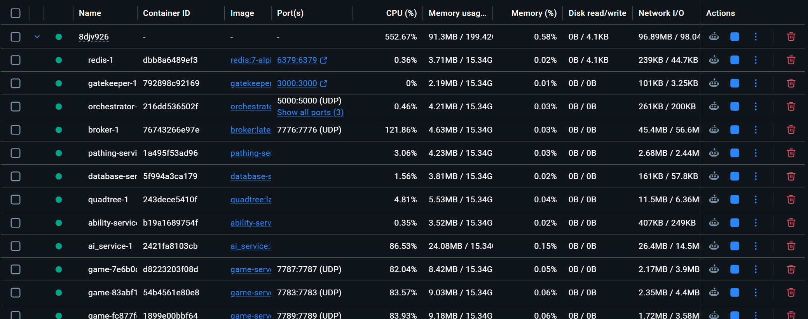
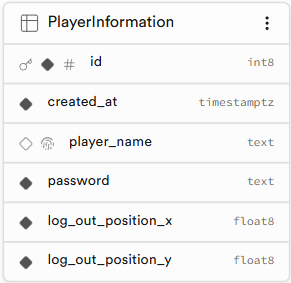
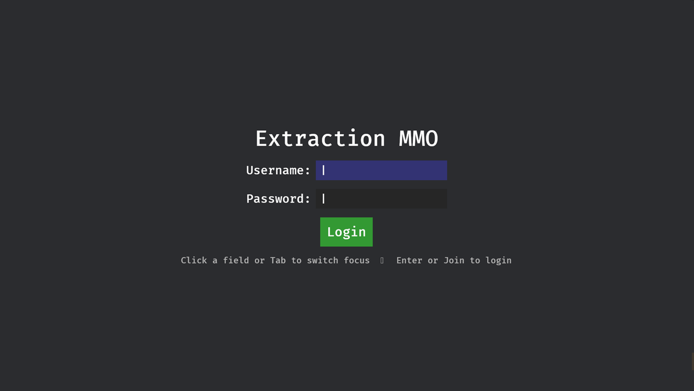
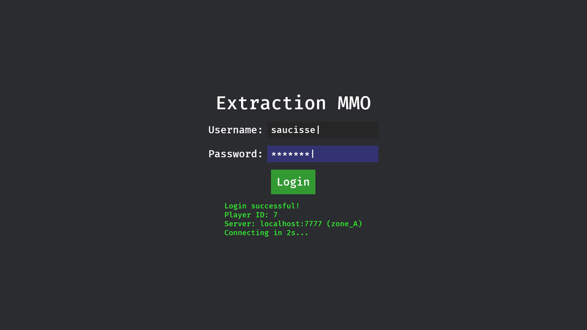
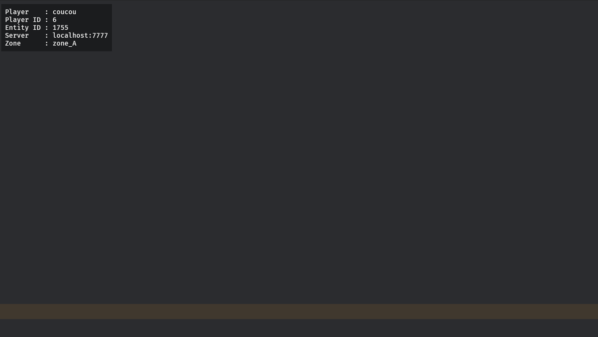
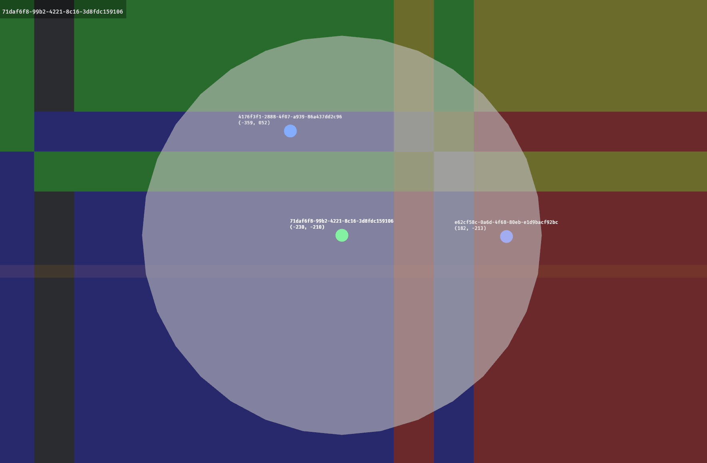
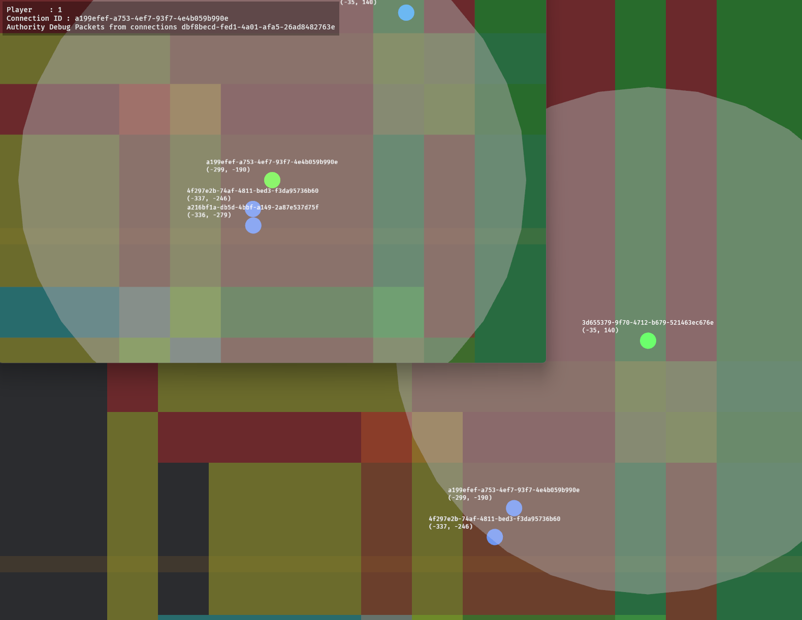
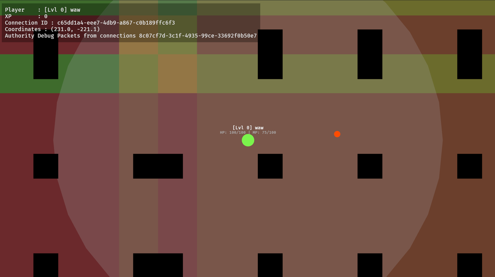
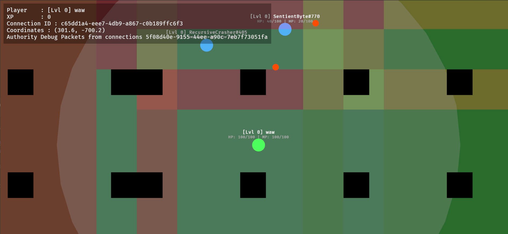

This project implements the necessary structure for a simplified MMO game:
- a **Gatekeeper**
- a **Pub/Sub Broker**
- an **Orchestrator**
- a quadtree-based **Spatial Service**
- **Dedicated Game Servers**
- a **Database Service**
- an **AI Service**
- an **Ability Service**
- a **Pathfinding Service**
- a **client**

## Team members:
- Bastien Gadoury
- Estevan Schmitt
- Grégory Toureille

## How to run the project

You need to have Docker Engine installed and running on your machine. Then, you can run the following command in the root directory of the project:
```bash
docker-compose up --build
```
Then the backend will be up and running.

 *There should be one container for each part of the project*

You will need to run the client separately. You can do it by running the following command in the root directory of the project:
```bash
cd client
cargo run
```
You will be able to connect to a new user or to an existing user if the password is correct. Gatekeeper will check the informations in the supabase database and then send the feedback to the client.
 *The database row*



Then you will be redirected to the broker, and the register to the spatial service so it can assign you to a server.



In the gatekeeper's logs you will be able to see the login feedbacks (wrong passeword, new user created...)

 *Game view for the client*

When connected you will be able to see the quadtree with margins, area of interest, entities and debug information in the client.





You can observe the authority change in the up left corner or in the servers and quadtree logs.

Environment variables are configured in the .env file.
See technical documentation in ARCHITECTURE.md.

## Gameplay

### Overview
The player can move around and fight against other players or NPCs. The player can also use abilities to heal themselves or to damage other players or NPCs. The zone in the center is a safe zone where players cannot be damaged. Player can gain experience points by killing other players or NPCs and can level up to increase their fireball damages. The player get mana points over time and can use them to cast abilities. The player can also die and respawn in the safe zone.

### Movement
The player can move using the WASD/Arrow keys or using the right mouse button (using the pathfinding service). The player will move to the destination and the position will be updated in the spatial service and the other clients will receive the update.

### Abilities
- Heal : Player can heal themselves using Q key. (the ability service check the mana cost and the cooldown before applying the heal)
- Fireball : Player can cast a fireball using left mouse button. (the ability service check the mana cost and the cooldown before applying the damage to the target)

 *A fireball being cast*

### AI
The AI service will spawn NPCs in the game randomly depending on the quadtree population. The NPCs patrol then if it sees a player it will chase and attack the player. If the player is out of sight, the NPC will go back to patrolling. The NPCs uses the pathfinding service to move around the map and use the same ability service as the player.

 *A player fighting two AIs*