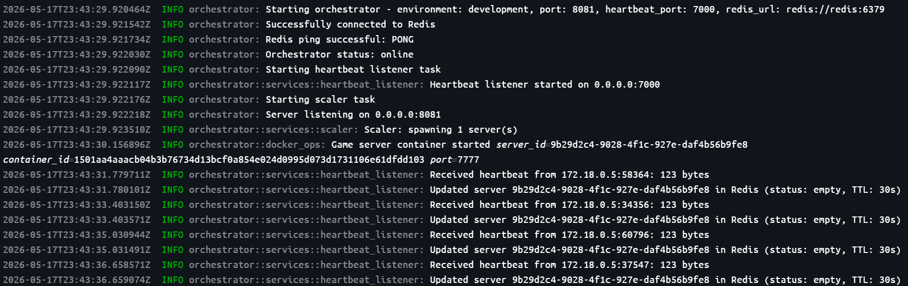
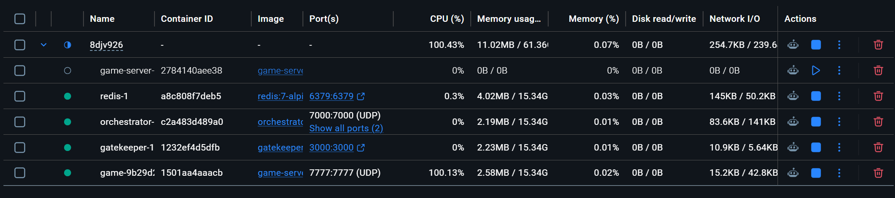
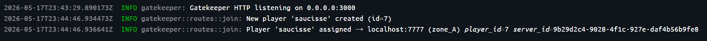
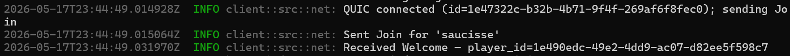
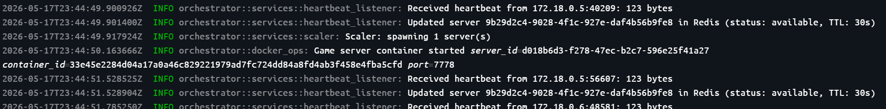
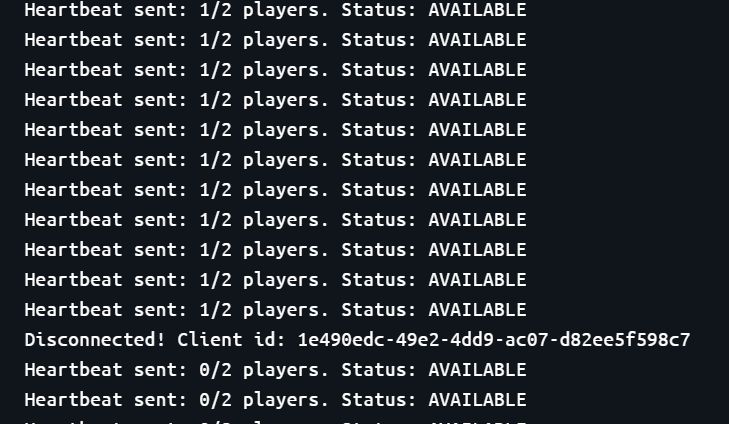

This project contains a implementation of a Gatekeeper, an Orchestrator, a server and a client.
## Team members:
- Bastien Gadoury
- Estevan Schmitt
- Grégory Toureille

## How to run the project

You need to have Docker Engine installed and running on your machine. Then, you can run the following command in the root directory of the project:
```bash
docker-compose up --build
```
Then the backend (gatekeeper, redis, orchestrator and potential servers) will be up and running.


 *Orchestrator starting logs*

 *There should be one container for each part of the project*


You will need to run the client separately. You can do it by running the following command in the root directory of the project:
```bash
cd client
cargo run
```
You will be able to connect to a new user or to an existing user if the password is correct.


Then you will be redirected to a server 


In the gatekeeper's logs you will be able to see the login feedbacks (wrong passeword, new user created...)



When you will be connected you will see a welcome message in the client's logs after a join request.



 *Game view for the client*

You can also see in orchestrator's logs that it creates and destroys servers in separate containers when needed.




The server should log the heartbeats sent and the orchestrator should log the heartbeats received.



Environment variables are configured in the .env file.